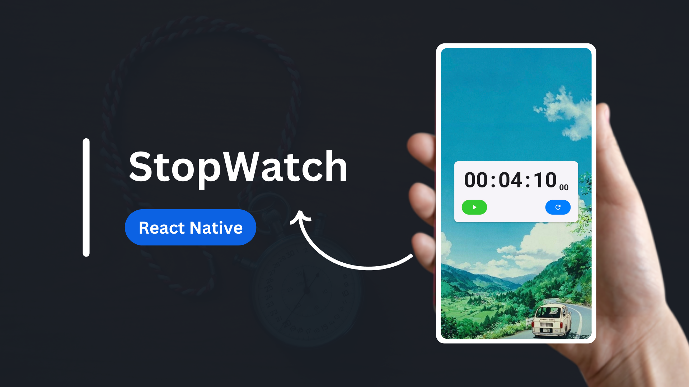
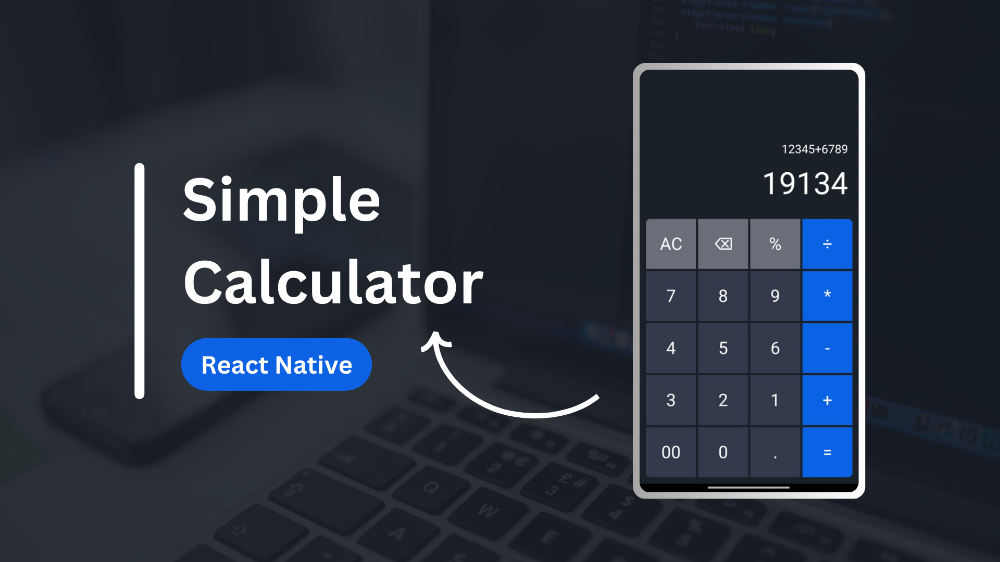
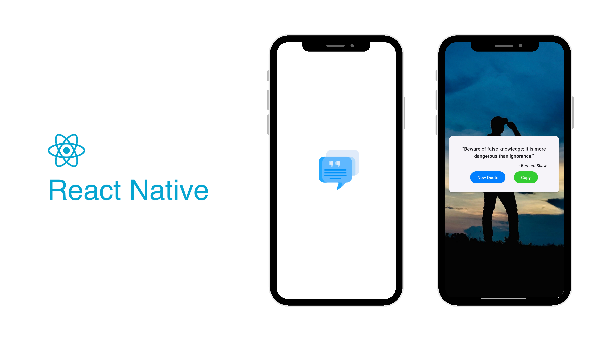

# React Native Stopwatch

A simple stopwatch component built using React Native.

## Features

- Start, pause, and reset functionality
- Displays time in hours, minutes, seconds, and milliseconds
- Background image customization

 
 
 

# React Native Calculator

A simple calculator app built using React Native.

## Features

- Basic arithmetic operations (addition, subtraction, multiplication, division)
- Percentage calculation
- Clear and backspace functionality

 
 
 

# React Native Quote App

A simple quote app built with React Native, React Native Paper, and Expo. It fetches a random quote from the Quotable API and allows you to copy the quote to your clipboard.

## Features

- Fetches a random quote from the Quotable API.
- Allows you to copy the quote to your clipboard.
- Displays the quote and its author.

 
 
 

# React Native Tic Tac Toe App

A classic Tic Tac Toe game built with React Native and React Native Paper. Players can take turns to mark the cells, and the game will determine the winner or declare a draw.

## Key Features
- Two-player game: Players X and O take turns to play.
- Winner Detection: Automatically detects the winner and displays a message.
- Draw Detection: Detects a draw when all cells are filled without a winner.
- Reset Game: Allows players to reset the game and start over.

 
 
 

# React Native Scanner App

A simple QR code scanner app built with React Native, Expo Camera, and Expo Clipboard. It allows you to scan QR codes, copy the scanned content to your clipboard, and open the scanned URL in a browser.

## Key Features

- QR Code Scanner: Scan QR codes using your device's camera.
- Copy to Clipboard: Copy the scanned URL to your device's clipboard.
- Open in Browser: Open the scanned URL in your device's default web browser.
